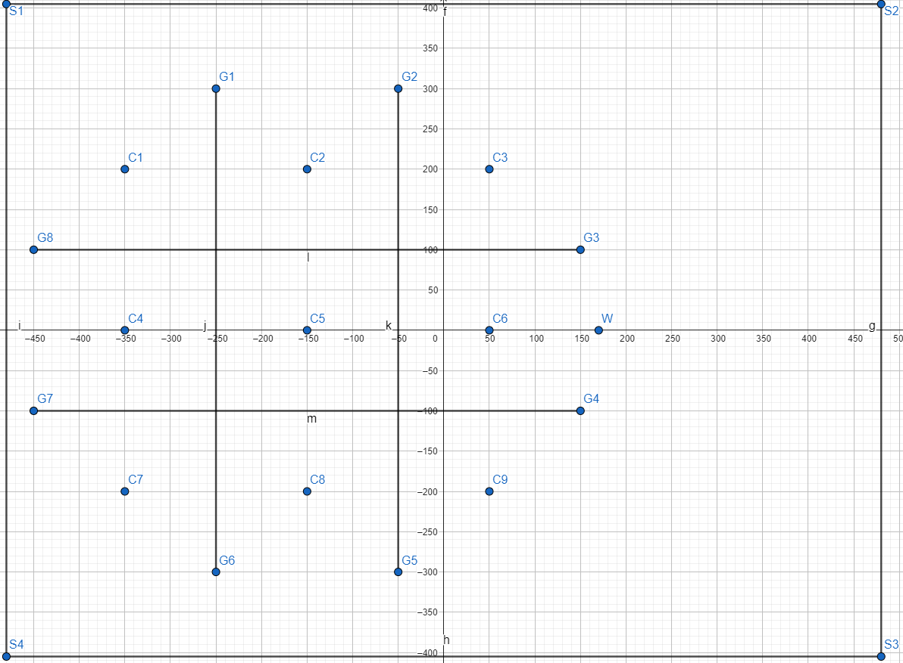
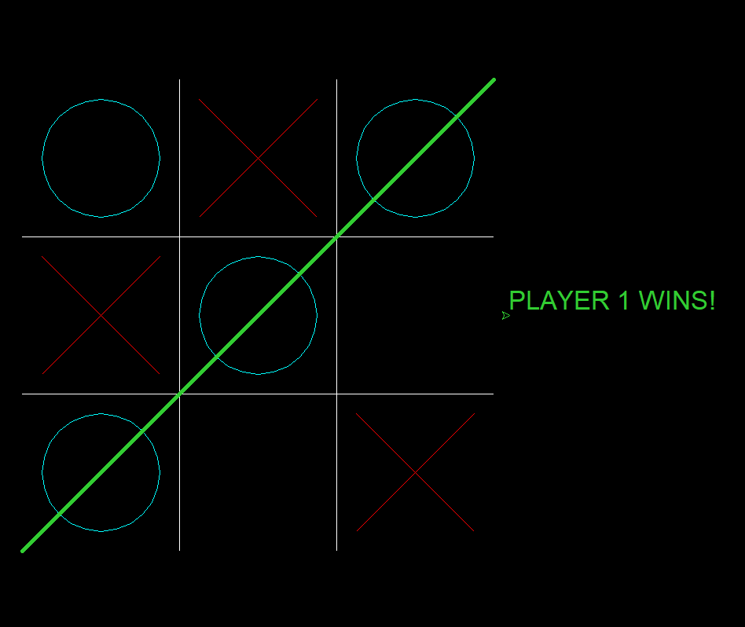

# Tic-Tac-Toe (Tris)
A simple version of the classic Tic-Tac-Toe game written in Python.

# Features
- Implemented using Python's turtle module
- 2-player mode (turn-based)

# Design
The `design` folder includes three files:

- `tris_design.ggb`
A GeoGebra file that shows the game grid structure, used as a reference for the
project design.

- `tris_design_screenshot.png`
A screenshot of the content of the above GeoGebra file:

- `game_interface_screenshot.png`
A screenshot of the game window, designed using Python's turtle module:

# How to play
- The game board is a 3x3 grid
- Click inside a cell to make a move
- The game alternates between Player 1 (circles) and Player 2 (crosses)
- Once a player wins or the board is full (draw), the game ends
- Press the space bar to restart the game.

# Requirements
- Python 3.x

# How to run
- Download or clone the repository
- In your terminal, navigate to the project folder and run the following script:
python tic_tac_toe.py

# Author
This project was developed by sir-s1m0n between January and February 2025.